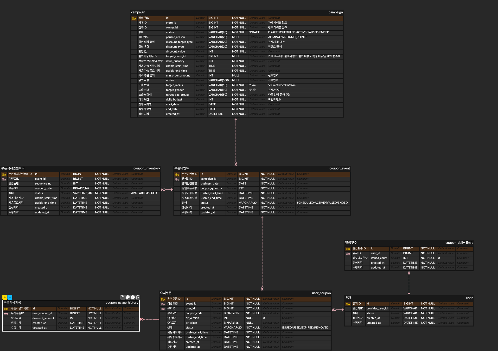

# 쿠폰 ERD와 구현 흐름



기준 이미지는 `쿠우폰 (9).png`다. 아래는 저장소 코드와 V4까지의 마이그레이션에 맞춘 설명이다.
패키지·서비스 메서드·API 대응은 [v1 구현 안내](v1/README.md)를 참고한다.
SQL은 실행 순서를 이해하기 위한 형태이며, 실제 JPA SQL은 컬럼 나열과 별칭이 다를 수 있다.
`:userId` 같은 값은 바인딩 파라미터다.

## 먼저 알아둘 기준

- **적재**: 아직 주인이 없는 재고 쿠폰을 미리 만든다.
- **발급**: 재고 한 장을 특정 사용자에게 준다.
- **사용**: 사용자의 쿠폰을 매장에서 한 번 사용하고 기록한다.
- **조회**: 사용자가 가진 쿠폰과 사용 결과를 읽는다.
- 같은 이벤트에서 사용자당 한 장, 전체 이벤트를 합쳐 한국 날짜 기준 하루 최대 3장이다.
- 쿠폰 코드와 QR 토큰은 Java `UUID.randomUUID()`로 만들고 MySQL `BINARY(16)`에 저장한다. API에서는 UUID 문자열로 반환한다.
- `coupon_code`는 쿠폰의 고정 식별자다. `qr_token`은 재발급할 때마다 바뀌는 60초짜리 사용 권한이다.
- `DATETIME`은 UTC로 저장한다. 영업일과 일일 한도는 한국 날짜로 계산한다. 예: 한국 11:00 → DB 02:00.
- 발급 후 캠페인 할인 조건·가게는 변경하지 않는 정책이다. 현재 코드에는 수정 API가 없다. 향후 변경을 허용하려면 발급 당시 조건을 별도 보관해야 한다.

### 이미지에서 보완한 부분

| 항목 | 실제 구현 | 이유 |
| --- | --- | --- |
| 이벤트 발급 시간 | `issue_start_at`, `issue_end_at` 추가 | 사용 시간과 발급 시간을 별도로 판정 |
| 일일 한도 날짜 | 생성 컬럼 `limit_date` 추가 | 오늘 행을 빠르게 찾고 사용자·날짜 중복 방지 |
| QR 만료 | `qr_expires_at` 추가 | 새 QR을 요청하지 않아도 60초 후 기존 QR 거절 |
| QR 버전 | `INT NOT NULL DEFAULT 0` | 최초 발급 상태를 명확히 표현 |
| 사용자 문자열 | 공급자 ID 255자, 상태 20자 | MySQL VARCHAR 길이 명시 |
| 사용 기록 | `UNIQUE(user_coupon_id)` | 사용자 쿠폰 1 : 사용 기록 0..1 강제 |
| 재고 연결 | `(event_id, coupon_code)` 복합 FK | 해당 이벤트의 실제 재고 코드만 사용자에게 발급 |
| 이벤트 상태 | `SOLD_OUT` 허용 | 향후 품절 전환에 사용할 값. 자동 전환·이벤트 발행은 아직 미구현 |

### 테이블과 필드가 필요한 이유

모든 `id`는 `BIGINT AUTO_INCREMENT` PK다. `created_at`은 생성 시각, `updated_at`은 마지막 변경 시각이며 서버가 초 단위로 입력한다.

| 테이블 | 필드 | 역할 |
| --- | --- | --- |
| campaign | store_id, owner_id | 행사를 만든 가게와 점주 |
| campaign | status, paused_reason | 캠페인 상태와 중단 사유 |
| campaign | discount_target_type, target_menu_id | 전체 주문 할인인지 특정 메뉴 할인인지 구분 |
| campaign | discount_type, discount_value | 정액 또는 정률 할인과 값 |
| campaign | issue_quantity | 하루 적재할 기본 수량 |
| campaign | usable_start_time, usable_end_time | 매일 적용할 사용 시간대. TIME 타입 |
| campaign | min_order_amount, notice | 최소 주문금액과 안내 |
| campaign | target_radius, target_gender, target_age_groups | 노출 설정. 현재 발급 코드에서는 타깃 판정하지 않음 |
| campaign | daily_budget | 예산 설정. 포인트 차감은 별도 도메인으로 아직 미구현 |
| campaign | start_date, end_date, created_at | 캠페인 기간과 생성 시각 |
| coupon_event | campaign_id, business_date | 어느 캠페인의 어느 날짜 행사인지 |
| coupon_event | coupon_quantity | 해당 날짜에 확정한 전체 수량. 남은 수량이 아님 |
| coupon_event | issue_start_at, issue_end_at | 발급 시작·종료 UTC 시각 |
| coupon_event | usable_start_time, usable_end_time | 날짜까지 포함한 사용 가능 UTC 시각 |
| coupon_event | status, created_at, updated_at | 이벤트 상태와 변경 이력 시각 |
| coupon_inventory | event_id, sequence_no | 이벤트와 적재 순번 |
| coupon_inventory | coupon_code | 미리 만들어 둔 쿠폰 UUID |
| coupon_inventory | status | AVAILABLE 또는 ISSUED |
| coupon_inventory | usable_start_time, usable_end_time | 이벤트에서 복사한 사용 기간 |
| coupon_inventory | created_at, updated_at | 적재·변경 시각 |
| user | provider_user_id, status | 외부 사용자 식별자와 계정 상태 |
| user | created_at, updated_at | 계정 생성·변경 시각 |
| coupon_daily_limit | user_id, issued_count | 사용자와 그날 발급 횟수 |
| coupon_daily_limit | created_at, updated_at, limit_date | 생성·변경 시각과 생성 시각에서 계산한 한국 날짜 |
| user_coupon | event_id, user_id, coupon_code | 누가 어느 이벤트의 어떤 쿠폰을 받았는지 |
| user_coupon | qr_version, qr_token, qr_expires_at | QR 교체 횟수, 현재 토큰, 만료 시각 |
| user_coupon | status | ISSUED / USED / EXPIRED / REMOVED |
| user_coupon | usable_start_time, usable_end_time | 발급 시 재고에서 복사한 사용 기간 |
| user_coupon | created_at, updated_at | 발급·변경 시각. created_at이 발급 시각 |
| coupon_usage_history | user_coupon_id, discount_amount | 사용한 쿠폰과 실제 할인금액 |
| coupon_usage_history | created_at, updated_at | 사용·변경 시각. created_at이 사용 시각 |

가게·점주·메뉴 테이블은 이 저장소 범위에 없어서 해당 ID에 외부 FK는 없다.
한 사용자에게 여러 로그인 공급자를 붙이는 계정 연동도 아직 구현하지 않았다.

## 1. 쿠폰 적재 흐름

### 1-1. 어떤 데이터를 만드는가?

예를 들어 한 캠페인이 9월 23일에 100장을 제공한다면 다음과 같다.

```text
campaign: 매일 100장, 사용 가능 11:00~14:00
  └─ coupon_event: 9월 23일, coupon_quantity=100
       ├─ inventory: 순번 1, UUID A, AVAILABLE
       ├─ inventory: 순번 2, UUID B, AVAILABLE
       └─ ... 순번 100, UUID Z, AVAILABLE

user_coupon: 아직 없음
coupon_usage_history: 아직 없음
```

재고에는 사용자 ID가 없다. 누가 받을지 아직 정해지지 않았기 때문이다.

### 1-2. 코드에서 어떻게 호출하는가?

`CouponService.prepareEvent(campaignId, date, issueStart, issueEnd, now)`를 호출한다.
이벤트가 이미 준비되어 있다면 `CouponService.loadInventory(eventId, now)`로 재고를 준비할 수 있다.

예: 한국 날짜 9월 23일, 발급 시간 11:00~13:00.
이 서비스는 명시적으로 호출하는 사전 적재 도구이며 앱 시작 시 실행되지 않는다.
캠페인의 사용 시간이 11:00~14:00이면 날짜와 결합하고 UTC로 변환해 저장한다.
사용 종료 시간이 시작 시간보다 이르거나 같으면 다음 날 종료하는 것으로 처리한다.

앱은 DB에 미리 적재된 데이터를 사용하며, 스케줄링 설정과 자동 상태 전환을 사용하지 않는다.
부하테스트에서는 k6의 `setup()`이 SQL로 데이터를 사전 적재한다. 서버에 테스트 전용 API나 프로필은 없다.
k6가 부하 실행 후 DB 정합성을 검증하고 해당 실행의 데이터만 삭제한다. [실행 안내](load-testing.md)

### 1-3. 어떤 SQL이 나가는가?

```sql
START TRANSACTION;

-- 동일 캠페인의 중복 준비 요청만 직렬화한다.
SELECT * FROM campaign WHERE id = :campaignId FOR UPDATE;

SELECT * FROM coupon_event
WHERE campaign_id = :campaignId AND business_date = :businessDate;

-- 기존 이벤트가 있으면 재고가 완성되어 있는지 확인하고 그대로 반환.
-- 없으면 새로 생성한다.
INSERT INTO coupon_event (
    campaign_id, business_date, coupon_quantity,
    issue_start_at, issue_end_at, usable_start_time, usable_end_time,
    status, created_at, updated_at
) VALUES (
    :campaignId, :businessDate, :quantity,
    :issueStartUtc, :issueEndUtc, :usableStartUtc, :usableEndUtc,
    'ACTIVE', :nowUtc, :nowUtc
);

-- 생성된 eventId에 대해 1~100번을 각각 저장한다.
INSERT INTO coupon_inventory (
    event_id, sequence_no, coupon_code, status,
    usable_start_time, usable_end_time, created_at, updated_at
) VALUES (
    :eventId, :sequenceNo, UUID_TO_BIN(:randomUuid), 'AVAILABLE',
    :usableStartUtc, :usableEndUtc, :nowUtc, :nowUtc
);

COMMIT;
```

Java는 UUID를 16바이트로 직접 바인딩하므로 실제 SQL에서 `UUID_TO_BIN()`을 호출하지 않아도 된다.

이벤트·재고 생성은 같은 트랜잭션이다. 중간에 실패하면 모두 롤백한다.
다시 호출하면 같은 `(campaign_id, business_date)` 이벤트를 반환하고 재고를 중복 적재하지 않는다.
일부 재고만 있는 비정상 상태는 임의로 채우지 않고 오류로 알린다.

현재 IDENTITY PK 때문에 재고 INSERT는 행별로 실행된다. 1,000건마다 flush하지만 이는 다중 행 INSERT 배치 최적화와는 다르다.

### 1-4. 11시에 어떻게 열리는가?

별도의 상태 전환 작업은 없다. 캠페인·이벤트는 **ACTIVE로 사전 적재**한다.
이벤트의 `coupon_quantity`만큼 AVAILABLE 재고를 전부 적재한 뒤 앱을 실행해야 한다.

10시 59분에 ACTIVE 데이터가 이미 있어도 발급은 11시부터 가능하다.
발급 서비스는 `status=ACTIVE AND issue_start_at <= 현재시각 < issue_end_at`을 검사한다.
현재 시각은 `Instant.now()`로 직접 확인하며, 잠금 대기 후에도 다시 확인한다.

## 2. 쿠폰 발급 흐름

API: `POST /api/v1/coupon-events/{eventId}/coupons`

```json
{"userId": 7}
```

### 2-1. 무엇이 바뀌는가?

```text
사용자 7이 이벤트 501의 쿠폰을 요청
  → 이미 받은 쿠폰이 있으면 같은 결과 반환
  → 사용자 7의 오늘 한도 행 잠금
  → 중복 발급·이벤트·발급 시각 확인
  → issued_count + 1
  → AVAILABLE 재고 한 행 잠금
  → 재고 상태 ISSUED
  → 같은 coupon_code로 user_coupon 생성
  → 함께 커밋
```

공통 `remaining_quantity`는 없다. 재고 한 행을 ISSUED로 바꾸는 것이 재고 차감이다.

### 2-2. 오늘 한도는 어떻게 찾는가?

`coupon_daily_limit.limit_date`는 다음 식으로 DB가 자동 계산한다.

```sql
limit_date DATE GENERATED ALWAYS AS
    (DATE(created_at + INTERVAL 9 HOUR)) STORED
```

예: UTC `2026-09-23 15:00:00`에 생성된 행의 한국 날짜는 `2026-09-24`다.
`created_at`은 처음 만든 후 바꾸지 않는다. 사용자·날짜 유니크 제약으로 하루 한 행만 생긴다.

### 2-3. 실제 실행 순서

발급 트랜잭션은 **READ COMMITTED**다. 같은 사용자 요청이 앞선 트랜잭션을 기다린 후, 최신 커밋된 쿠폰을 확인할 수 있다.

```sql
-- 빠른 멱등 응답: 이미 발급되었으면 재고와 한도에 손대지 않는다.
SELECT * FROM user_coupon WHERE event_id = :eventId AND user_id = :userId;

-- 없으면 발급 트랜잭션 시작
START TRANSACTION;

SELECT * FROM `user` WHERE id = :userId;
-- ACTIVE 사용자만 진행한다.

INSERT INTO coupon_daily_limit (user_id, issued_count, created_at, updated_at)
VALUES (:userId, 0, :nowUtc, :nowUtc)
ON DUPLICATE KEY UPDATE id = id;

-- 앞선 동일 사용자 요청이 끝난 뒤 다시 확인한다.
SELECT * FROM user_coupon WHERE event_id = :eventId AND user_id = :userId;
-- 이미 있으면 증가 없이 기존 결과를 반환한다.

SELECT * FROM coupon_event WHERE id = :eventId;
SELECT * FROM campaign WHERE id = :campaignId;
-- 이벤트 ACTIVE, 캠페인 ACTIVE, 발급 시간 범위인지 서버가 확인.
-- 한도 행을 기다리던 도중 한국 날짜가 바뀌면 재시도를 요청한다.

UPDATE coupon_daily_limit
SET issued_count = issued_count + 1, updated_at = :nowUtc
WHERE user_id = :userId AND limit_date = :koreanDate AND issued_count < 3;
-- 갱신 0건이면 DAILY_ISSUANCE_LIMIT_EXCEEDED, 전체 롤백.

SELECT * FROM coupon_inventory
WHERE event_id = :eventId AND status = 'AVAILABLE'
ORDER BY sequence_no
LIMIT 1 FOR UPDATE SKIP LOCKED;

UPDATE coupon_inventory
SET status = 'ISSUED', updated_at = :nowUtc
WHERE id = :inventoryId;

INSERT INTO user_coupon (
    event_id, user_id, coupon_code, qr_version, qr_token, qr_expires_at,
    status, usable_start_time, usable_end_time, created_at, updated_at
) VALUES (
    :eventId, :userId, :inventoryCouponCode, 0, NULL, NULL,
    'ISSUED', :usableStartUtc, :usableEndUtc, :nowUtc, :nowUtc
);

COMMIT;
```

중간에 재고가 없거나 저장이 실패하면 한도 증가·재고 변경·쿠폰 생성이 전부 취소된다.
`(event_id, user_id)`, `coupon_code` 유니크 제약과 재고 FK가 추가로 중복·잘못된 연결을 막는다.

### 2-4. 잠겨 있는 재고와 품절은 구분한다

`SKIP LOCKED`는 다른 요청이 잠근 행을 건너뛴다. 따라서 조회 0건만으로 품절이라고 판단하지 않는다.

재고를 못 찾으면 먼저 발급 트랜잭션을 롤백한 뒤, 새 조회로 다음을 확인한다.

```sql
SELECT id FROM coupon_inventory
WHERE event_id = :eventId AND status = 'AVAILABLE'
LIMIT 1;
```

- AVAILABLE이 남아 있으면 `INVENTORY_BUSY`(409): 처리 중인 요청이 있으므로 잠시 후 재시도한다.
- AVAILABLE이 없으면 `COUPON_SOLD_OUT`(409): 현재 커밋된 데이터 기준으로 재고가 없다.

이 조회는 **재고 선점 실패 때만** 실행하며, 모든 발급마다 전체 COUNT를 수행하지 않는다.
시퀀스 마지막 번호를 발급했다고 전체 완료로 판단하지도 않는다.
현재는 오류 응답만 구분한다. `SOLD_OUT` 상태 전환, Redis, 도메인 이벤트, Outbox는 아직 구현하지 않았다.

## 3. 쿠폰 사용 흐름

### 3-1. QR을 발급하거나 교체한다

API: `POST /api/v1/user-coupons/{id}/qr`, 요청 `{"userId":7}`.

```sql
START TRANSACTION;
SELECT * FROM user_coupon WHERE id = :couponId AND user_id = :userId FOR UPDATE;

-- ISSUED이고 사용 기간 안인지 확인.
UPDATE user_coupon
SET qr_token = UUID_TO_BIN(:newRandomUuid),
    qr_version = :oldVersion + 1,
    qr_expires_at = :expiresUtc,
    updated_at = :nowUtc
WHERE id = :couponId;
COMMIT;
```

만료 시각은 `현재 + 60초`와 `쿠폰 사용 종료` 중 빠른 값이다.
기존 토큰을 새 토큰으로 덮어쓰므로 이전 QR은 즉시 사용할 수 없다.
새 QR 요청이 없어도 서버의 만료 검사로 60초 뒤 거절된다.

자동으로 60초마다 화면 QR을 바꾸는 것은 클라이언트가 이 API를 반복 호출해 구현해야 한다.
이 프로젝트는 토큰 API까지 구현하며 QR 이미지 생성·클라이언트 타이머는 포함하지 않는다.
토큰에 userId나 쿠폰 정보를 넣거나 SHA-256 암복호화를 하지 않는다. 임의의 UUID 자체가 조회 키다.

### 3-2. 점주가 스캔해서 사용한다

API: `POST /api/v1/coupon-usages`.

```json
{
  "qrToken": "API에서 받은 UUID",
  "storeId": 1,
  "ownerId": 2,
  "orderAmount": 10000,
  "menuId": null,
  "menuAmount": null
}
```

특정 메뉴 할인일 때는 `menuId`와 해당 메뉴 합계 `menuAmount`도 입력한다.
서버는 캠페인 최소 주문금액·대상 메뉴를 확인하고 할인액을 계산한다.
정률 할인은 원 단위로 내림, 정액 할인은 할인 대상 금액을 넘지 않게 제한한다.

```sql
START TRANSACTION;
SELECT * FROM user_coupon WHERE qr_token = UUID_TO_BIN(:qrToken) FOR UPDATE;
SELECT * FROM coupon_event WHERE id = :eventId;
SELECT * FROM campaign WHERE id = :campaignId;

-- 가게·점주 일치, 사용 가능 상태/시간, QR 만료, 할인 조건을 서버에서 확인.
UPDATE user_coupon
SET status = 'USED', qr_token = NULL, qr_expires_at = NULL, updated_at = :nowUtc
WHERE id = :couponId AND status = 'ISSUED'
  AND qr_token = UUID_TO_BIN(:qrToken)
  AND usable_start_time <= :nowUtc AND usable_end_time > :nowUtc
  AND qr_expires_at > :nowUtc;

-- 1건 수정된 경우에만 기록한다.
INSERT INTO coupon_usage_history (user_coupon_id, discount_amount, created_at, updated_at)
VALUES (:couponId, :calculatedDiscountAmount, :nowUtc, :nowUtc);
COMMIT;
```

사용 상태 변경과 기록 생성은 같은 트랜잭션이다.
`UNIQUE(user_coupon_id)` 때문에 한 쿠폰의 사용 기록은 최대 하나다.
사용되지 않은 쿠폰은 사용 기록이 없다. 관계는 **사용자 쿠폰 1 : 사용 기록 0..1**이다.
사용 후에는 토큰이 제거되므로 다시 스캔하면 거절된다.

재고 품절이나 이벤트 발급 종료는 이미 받은 쿠폰의 사용을 막지 않는다.
사용 가능 여부는 사용자 쿠폰의 상태·사용 기간·현재 QR로 판정한다.

## 4. 쿠폰 조회 흐름

### 4-1. 내 쿠폰 목록

API: `GET /api/v1/users/{userId}/coupons?page=0&size=20`.
페이지 크기는 최대 100이다.

```sql
SELECT * FROM user_coupon
WHERE user_id = :userId
ORDER BY created_at DESC, id DESC
LIMIT :size OFFSET :offset;

-- Page 응답에 전체 건수가 필요한 경우 함께 실행된다.
SELECT COUNT(*) FROM user_coupon WHERE user_id = :userId;
```

조회용 인덱스는 `(user_id, created_at, id)`다.
API에 QR 토큰은 포함하지 않는다. 토큰은 QR API로만 얻는다.

DB 상태가 아직 ISSUED여도 사용 종료 시각이 지났으면 응답은 EXPIRED로 계산한다.
현재 만료 배치가 DB 상태를 자동 변경하지는 않는다.

### 4-2. 쿠폰 상세와 사용 기록

API: `GET /api/v1/user-coupons/{id}?userId=7`.

```sql
SELECT * FROM user_coupon WHERE id = :couponId AND user_id = :userId;
SELECT * FROM coupon_usage_history WHERE user_coupon_id = :couponId;
```

쿠폰이 없거나 해당 사용자 소유가 아니면 404다.
미사용 쿠폰의 `usedAt`, `discountAmount`는 NULL이며,
사용한 쿠폰은 사용 기록의 `created_at`과 `discount_amount`를 반환한다.

가게는 `사용 기록 → 사용자 쿠폰 → 이벤트 → 캠페인.store_id`로 찾을 수 있어 사용 기록에 중복 저장하지 않았다.

## 실행과 남아 있는 범위

- V3 마이그레이션은 승인받은 **연습·부하테스트용 기존 4개 테이블 데이터를 삭제**하고 새 7개 테이블을 만든다. 실데이터 환경에 적용하면 안 된다.
- V1/V2는 이미 적용된 Flyway 체크섬을 유지하기 위해 수정하지 않았다.
- [부하테스트](load-testing.md)는 k6가 테스트 DB에 캠페인 30개·이벤트 30개·재고 15,000개·사용자 50,000명을 적재하고, HTTP 부하·DB 검증·실행별 정리를 수행한다. 앱에는 부하테스트 전용 코드가 없다.
- V4는 과거 SCHEDULED 상태를 ACTIVE로 변환한다. V1~V3 파일은 적용 이력과 체크섬 유지를 위해 그대로 둔다.
- 현재 API는 연습용으로 userId·ownerId를 요청에서 받는다. **인증·인가가 구현된 서비스가 아니다.** 실서비스에서는 로그인 정보로 ID를 결정하고, 주문 금액도 서버의 주문/POS 데이터에서 가져와야 한다.
- 가게·점주·메뉴 CRUD, 타깃 노출·포인트 차감, 품절 도메인 이벤트, 취소·환불 처리는 범위 밖이다.
