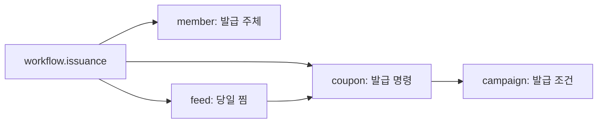
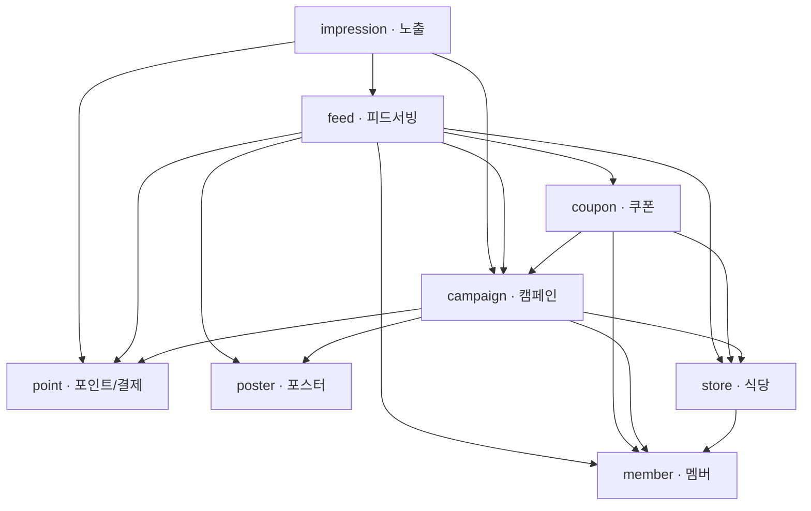
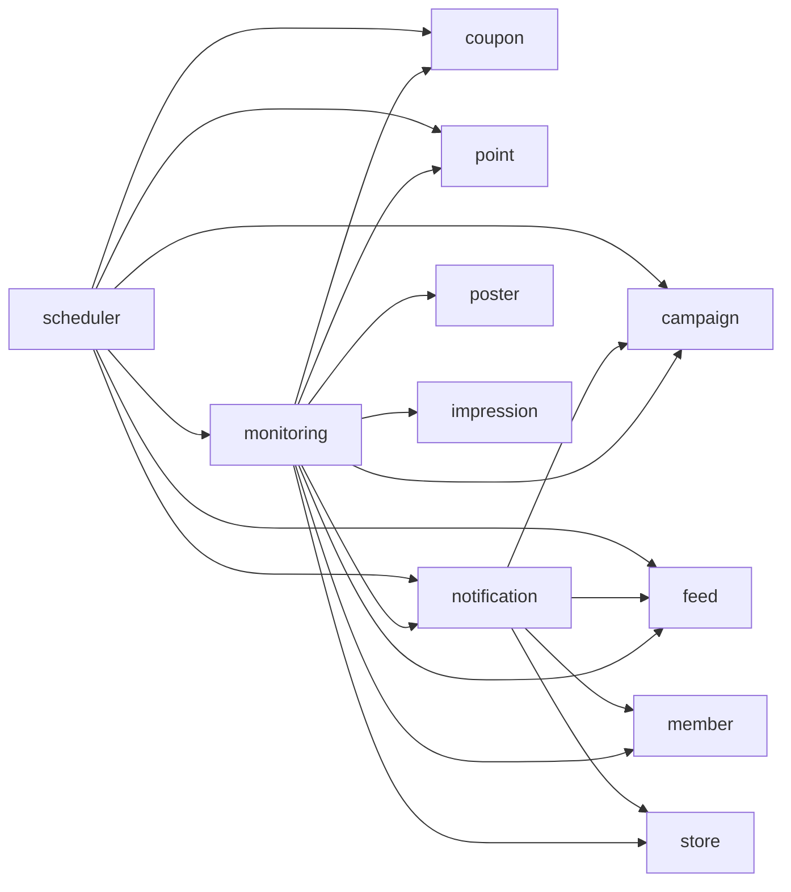

# 런치캐치 V14 유스케이스와 도메인 참조 설계

분석일: 2026-09-22. 원본: `V14_런치캐치_요구사항명세서.xlsx`의 12개 시트. 기능 명세서 제목은 `v0.23 초안`으로 되어 있다. 파일명 버전과 시트 내부 버전을 구분한다.

이 문서는 요구사항으로부터 도출한 **구현 전 설계안**이다. 아래 Service 이름과 패키지 참조는 제안이며 현재 코드의 의존성을 측정한 결과가 아니다. 원본 엑셀이나 애플리케이션 코드는 변경하지 않았다.

## 1. 읽는 방법과 설계 전제

- `F083`은 원본 `기능 명세서!A83:J83`을 뜻한다. 원본에 일관된 요구사항 ID가 없어 실제 행 번호를 이 문서의 추적 ID로 사용한다. 원본에 적힌 과거 문서의 `#번호`와 다르다.
- `도메인 정의` 시트의 담당 행 번호는 현재 기능 시트와 어긋난다. 기능 이름·세부 사항·예외 사항을 함께 읽어 매핑했다.
- `member`는 원본의 `identity`, `monitoring`은 원본의 비즈니스 리포트/운영 `report`에 대응한다. Actuator·Prometheus 등 기술 관측 설정은 `infra.observability`로 구분한다.
- 기능 우선순위는 원본을 유지한다. 아래 유스케이스는 필수·권장 기능을 함께 묶은 경우가 있으며, 묶었다고 권장 기능을 필수로 바꾸지 않는다.
- `A → B`는 **A 코드가 B의 공개 Java 타입/Service를 참조**한다는 뜻이다. 데이터가 이동하는 방향, DB FK 방향, 업무 발생 순서와 구분한다.
- 배치가 B 데이터를 조회해 A에 저장한다면 코드 참조는 `배치 → B`, `배치 → A`다. `B → A`라는 화살표를 만들지 않는다.
- 공개 타입은 `service`의 명시적으로 공개한 기능과 `dto`의 Command/Result다. 다른 도메인의 Entity·Repository·Redis 키에 직접 접근하지 않는 규칙을 제안한다. 서비스마다 인터페이스를 만들 필요는 없다.
- Spring 이벤트 리스너 없이, 즉시 필요한 작업은 명시적 서비스 호출로 처리하고 알림 예약·집계는 배치가 처리한다. 같은 DB의 트랜잭션도 Redis·PG·푸시 전송까지 원자적으로 묶어 주지는 않는다.
- `workflow`는 여러 도메인을 조합하는 유스케이스 계층이다. 새 비즈니스 도메인이나 두 번째 Spring Boot Application이 아니다. 모든 서비스를 여기에 옮기지 않고 순환 참조가 생기는 흐름에 한정한다.

## 2. 도메인별 데이터와 규칙 소유권

| 도메인 | 이 설계에서 소유하는 것 | 다른 도메인과의 경계 |
| --- | --- | --- |
| `member` | 관리자·점주·사용자 계정, 인증, 상태, 소셜 식별자, 프로필·동의·저장 위치, 관심 가게·차단 관계 | 가게 운영 상태나 캠페인 상태는 직접 수정하지 않는다. 가게 유효성 검증과 복합 목록은 workflow에서 조합한다. |
| `store` | 입점 등록, 사업자 Mock 검증, 가게·메뉴·이미지·좌표, 소유 점주 관계 | 최종 등록 시 `member`의 활성화 기능을 사용한다. 캠페인·포스터·쿠폰이 포함된 화면은 workflow에서 조합한다. |
| `campaign` | 할인 조건 원본, 타겟, 집행 기간, 하루 예산 설정, 캠페인 상태·중단 사유, 적용 정책 버전 | 포스터 검수 결과와 포인트 잔액을 이용해 상태를 결정한다. 포인트 원장·실제 쿠폰 재고는 소유하지 않는다. |
| `poster` | 템플릿·게시 버전, 포스터 슬롯·미리보기·편집 세션, 검수 기준·결과 | 검수는 PASS/FAIL을 반환한다. 캠페인 상태 변경은 campaign이 수행한다. |
| `point` | 결제·환불·포인트 정책·일별 단가, 잔액·원장·실제 소진량, 중복 차감 방지 | 잔액 부족 결과를 반환한다. 캠페인 중단/재개나 환불 전 캠페인 검사는 상위 유스케이스가 수행한다. |
| `feed` | serve 기록, 피드 구성·정렬, 필터·찜·패스, 노출 상한용 카운터, 관련성 이력, 예산 소진 진행률 계산 | 진행률의 원본 소진액은 point에서 받는다. 노출 유효성 원본은 impression이다. 찜 소유권은 아래 확인 사항 참조. |
| `impression` | 카드 표시 수집, 유효/무효 판정·이력, 중복 노출 방지 | feed가 공개한 serve 조회로 검증하고 point에 차감을 요청한다. 소진액을 별도 원장으로 중복 소유하지 않는다. |
| `coupon` | 영업일별 재고·오픈, 발급 순번·쿠폰 코드·발급 이력, 일 3개 제한, QR·사용·만료 | 발급 전 찜 검증은 workflow에서 feed에 요청한다. 발급·사용 조건은 campaign의 정책 원본을 조회하거나 검증된 스냅샷으로 받는다. |
| `notification` | 발송 예약·상태·재시도·중복 키, 수신함·읽음, 실제 전송 | 수신 동의 원본은 member다. 발송 시 찜/관심 가게·캠페인 상태를 다시 확인한다. |
| `monitoring` | 퍼널/감사 로그의 조회·수집, 일별 집계, 정산 대조, 운영 진단·대시보드 | 조회·집계의 소비자다. 계정 정지 등 실제 명령은 해당 업무 유스케이스로 전달한다. |

원본에서 데이터 소유권이 겹치는 부분에 대한 잠정안:

1. **찜**: `도메인 정의!B11`은 coupon에 찜을 포함하지만 F068·F075·F076은 feed의 기능이다. 이 문서는 기능 시트에 맞춰 feed에 단일 저장소를 두고, 발급 조합 서비스가 찜을 확인하는 안을 사용한다. coupon으로 옮기는 안도 가능하지만 두 곳에 각각 원본을 두면 안 된다.
2. **차단**: F071은 feed 화면, F092와 `도메인 정의!B4`는 member 소유다. 원본 관계는 member, feed는 조회자로 둔다. 화면 위치가 저장소 소유권을 결정하지 않는다.
3. **알림 동의**: F063·F090에 따라 member가 원본을 소유한다. notification은 발송 판단에 사용한다.
4. **예산**: campaign은 예산 설정, point는 실제 소진·차감 상한, feed는 시간 대비 진행률을 소유한다. 같은 잔액을 세 모듈이 각각 쓰지 않는다.

## 3. 기능 100개를 묶은 유스케이스 42개

흐름의 `→`는 이 표 안에서는 실행 순서다. 실제 패키지 의존성은 5절의 그래프·허용 목록으로 따로 정의한다. 인증된 행위자 ID/역할만 필요한 경우에는 인증 컨텍스트를 사용하며 모든 서비스에 member 조회를 추가하지 않는다.

| UC | 사용자 목표·행위자 | 근거 | 주관·조합 위치 | 기본 흐름 / 결과 / 주요 예외 |
| --- | --- | --- | --- | --- |
| UC01 | 최고 관리자가 관리자 계정 발급 | F004 | member | 최고 관리자 권한·ID 중복 확인 → 트랜잭션 밖 비밀번호 해싱 → 계정·감사 원본을 함께 저장. 중복·권한 부족 거부. |
| UC02 | 관리자·점주·사용자가 가입/로그인/세션 관리 | F005, F006, F007, F031, F032, F033, F034, F062, F064, F065, F094 | member | 자체 인증 또는 소셜 인증 → 역할·상태 확인 → 토큰 발급/회전/폐기. 재사용 토큰은 전체 세션 폐기. 점주 가입은 ONBOARDING. F007의 카카오 로그아웃은 확인 필요. |
| UC03 | 사용자가 온보딩·프로필·동의·위치 관리 | F063, F066, F087, F088, F090, F093 | member | 필수 입력 확인 → 프로필/동의/위치 저장 → 조회. 동의 변경 즉시 반영. 위치 거부 후 수동 입력 허용 범위는 확인 필요. |
| UC04 | 관리자가 회원 검색 | F010, F011 | member / workflow.account | member 페이지 조회 → 점주 목록만 store 요약 일괄 결합. 탈퇴 개인정보 마스킹, 빈 목록 허용. member가 store Repository를 참조하지 않는다. |
| UC05 | 관리자가 회원 정지·탈퇴 / 사용자가 탈퇴 | F012, F089 | workflow.account | 권한·재인증 확인 → member 상태 변경 → 점주라면 campaign 즉시 중단, 사용자 탈퇴라면 coupon 즉시 만료 → 감사 원본 저장. 재가입 제한 식별자는 유지. |
| UC06 | 점주가 입점 항목 작성 / 관리자가 진행 조회 | F008, F009, F035, F036, F037, F038, F039, F040, F041 | store | 본인 가게·단계 확인 → 약관·기본 정보·지도 장소·사업자 Mock·시간·이미지·메뉴 저장 → 실제 데이터 기준 진행률 반환. 관리자 승인 단계 없음. 영업신고증은 권장. |
| UC07 | 점주가 가게 최종 등록 | F042 | store → member | 필수 등록 항목 검증 → store 최종 등록 → member ONBOARDING에서 ACTIVE 전환. 같은 DB 트랜잭션으로 실패 시 둘 다 유지. |
| UC08 | 사용자가 주변 가게 검색·상세 확인 | F072, F073, F074 | workflow.storeview | store 위치 검색/상세 → campaign·poster·coupon 잔여량·feed 찜 상태·member 관심 상태를 조합. map_view/poster_open만 기록, 과금 없음. |
| UC09 | 사용자가 관심 가게 등록/해제·목록 조회 | F077, F078 | workflow.memberstore | store 운영 상태 확인 → member 관심 관계 멱등 저장/삭제. 목록은 member 관계에 store·campaign 요약 결합. 관심 등록은 피드 순위에 미반영. |
| UC10 | 사용자가 추천 가게 차단/해제 | F071, F092 | workflow.memberstore / member | 가게 확인 → member 차단 관계 갱신 → 다음 feed부터 적용. 기존 찜은 유지. feed는 차단 목록을 읽고 필터링한다. |
| UC11 | 관리자가 템플릿 생성·수정·버전 저장·게시·활성화 | F014, F015, F016, F017, F018, F019 | poster | LLM 초안 → HTML·슬롯·팔레트 검증 → 임시저장 → 선택 버전 게시 → 활성화. 금지 태그/외부 리소스 제거, 미게시 활성화 거부. |
| UC12 | 점주가 사용 가능한 템플릿 선택 | F053 | poster | 게시·활성 템플릿만 조회. 없으면 빈 목록. |
| UC13 | 점주가 캠페인 포스터 생성·편집·조회 | F054, F055, F056 | workflow.poster | campaign 소유권·편집 가능 상태, store 자료 확인 → 검증된 컨텍스트로 poster 생성/수정. HTML 구조 고정, 허용 슬롯만 편집. |
| UC14 | 관리자가 소재 검수 기준 변경 | F029 | poster / workflow.poster | 기준 버전 저장 → 변경 이후 대상부터 적용 → 필요 공지는 notification에 예약. 진행 중 검수에 소급 적용하지 않는다. |
| UC15 | 시스템이 포스터 자동 검수 | F057 | poster | 특정 포스터·기준 버전 검수 → PASS/FAIL·사유 반환. 외부 검수 장애도 FAIL. campaign 상태 전환은 UC19가 결정한다. |
| UC16 | 점주가 캠페인 쿠폰 조건·타겟 작성 | F043, F044 | campaign | member ACTIVE·store 소유권 확인 → 할인·시간·수량·대상 검증 → DRAFT 저장. 입력만으로 재고 발급은 하지 않는다. |
| UC17 | 점주가 하루 예산·기간·예상 노출 확인 | F045 | campaign / workflow.campaign | point 단가·최소 예산, campaign 경쟁 예산, member의 지역별 비식별 이용 집계를 조합 → 예상치 표시 → 기간·예산 저장. 잔액 부족만으로 저장 거부하지 않는다. 이용 집계의 원본/지역 기준은 확인 필요. |
| UC18 | 점주·관리자가 캠페인 목록/현황 조회 | F013, F026, F046 | campaign / workflow.campaign | 자기 캠페인 또는 관리자 범위 조회. 복합 화면은 store·poster·point·impression 요약을 workflow에서 결합. 단순 상세는 campaign만 사용. |
| UC19 | 점주가 캠페인 활성화 요청 | F047 | campaign | store·member 자격 → poster 존재 → point 잔액 ≥ 하루 예산 → poster 검수 → PASS면 SCHEDULED. FAIL이면 DRAFT. 당일 즉시 ACTIVE가 아니다. |
| UC20 | 점주·관리자·시스템이 캠페인 중단/재개·종료 | F048, F095 | campaign | 요청 주체·중단 사유·기간 검증 → 허용 상태 전이와 감사 원본 저장. OWNER는 ADMIN 중단 해제 불가. 예산/수량 소진은 당일 게재 제어이며 ENDED가 아니다. |
| UC21 | 관리자가 단가·충전 상품·예산 정책 변경 | F021 | point | 값 검증 → 정책 버전·적용일 저장. 단가는 익일 적용, 과거 일별 적용 단가는 보존. |
| UC22 | 점주가 테스트 결제로 포인트 충전 | F049 | point / workflow.payment | PG 승인 검증 → 결제키 멱등 확정 → CHARGE·잔액 저장. UNKNOWN은 재조회. 즉시 캠페인 재개를 선택하면 workflow가 campaign을 호출한다. |
| UC23 | 점주·관리자가 잔액·결제·원장 조회 | F022, F024, F050 | point | 결제/원장 페이지 조회, 원장 기준 잔액 반환. 캐시 장애 시 DB 기준 조회. |
| UC24 | 점주가 환불 요청 / 관리자가 승인·반려 | F023, F052 | workflow.payment | campaign 환불 제한 확인 → point 유상 잔액·중복 요청 검사 → 요청 저장 → 승인 시 Mock/PG 처리·REFUND 기록. 활성화와 환불의 동시 실행 제어 필요. |
| UC25 | 시스템이 포인트 부족 캠페인 게재 중단 | F051 | impression에서 조합 / campaign | point 차감 결과가 NO_POINTS → campaign PAUSED(NO_POINTS) → 다음 feed부터 제외. point가 campaign을 역호출하지 않는다. |
| UC26 | 사용자가 공정성·관련성 피드 조회 | F067, F096, F097, F098 | feed | member 위치·동의·타겟/차단 → campaign 후보·store·poster → coupon 재고·point 실제 소진 → 배분 3/관련성 7 정렬 → serve 캐시·DB 기록. 시간 밖 빈 응답, 요청 상한 429. |
| UC27 | 사용자가 피드 필터 저장 | F070 | feed | 카테고리·정렬 저장 → 배분 슬롯은 카테고리만, 관련성 슬롯은 정렬까지 적용. 전체 해제는 전체 카테고리로 해석. |
| UC28 | 사용자가 카드를 찜/패스 | F068 | feed | serve 사용자/캠페인 확인 → 중복 행위 억제 → 찜 또는 당일 패스 기록. 노출 판정·포인트 차감을 다시 하지 않는다. |
| UC29 | 사용자가 찜 목록 조회/삭제 | F075, F076 | feed | 찜에 campaign 상태·coupon 잔여량/당일 잔여 횟수 결합. 삭제 시 당일 재노출 제외. 알림은 발송 시 찜 상태를 재검증해 취소한다. |
| UC30 | 시스템이 카드 표시 노출을 수집·검증 | F069, F099 | impression | feed 공개 serve 조회 → 존재/기한·사용자 일치 검증 → serve_id 멱등 판정 → 유효/무효 원본 저장 → 유효 건만 UC31. 결과 202. |
| UC31 | 시스템이 유효 노출 비용 차감 | F102 | point, 호출자는 impression | 서버가 확정한 캠페인/점주·당일 단가·예산으로 원자 차감 → DEDUCT 기록. 중복 serve_id 차감 방지. 캐시/원장 장애 복구와 초과 한도 정책 확인 필요. |
| UC32 | 사용자가 선착순 쿠폰 발급 | F083 | workflow.issuance | member 유효/안정 식별자 → feed 당일 찜 → coupon 내부 campaign·오픈·제한 검증 → 재고 선점 → DB 발급 확정. 캠페인별 초과·동일 영업일 중복·하루 3개 초과 방지. |
| UC33 | 사용자가 쿠폰함·사용 내역 조회 | F084, F086 | coupon | 본인 발급 내역을 상태/기간으로 조회 → 발급 당시 조건·사용 시간 표시. 없으면 빈 목록. |
| UC34 | 사용자 QR 생성 / 점주 QR 사용 처리 | F058, F085 | coupon | 본인·member 상태·사용시간 확인 → 60초 서명 QR → 점주 스캔 시 store 소유권·서명·시간·jti·미사용 검증 → 사용 확정. 위치 200m 검증은 권장. |
| UC35 | 사용자 오픈/관심 가게 알림·수신함 / 점주 발송 현황 | F061, F079, F080, F081, F082 | notification, scheduler 기동 | campaign 대상 + feed 찜 또는 member 관심 가게 + 현재 동의 확인 → 날짜·유형 중복 키로 발송 → 이력/수신함 기록. 점주는 store 소유권 확인 후 조회. |
| UC36 | 관리자·점주·사용자가 집계 대시보드 조회 | F020, F025, F060, F091 | monitoring | 일별 배치로 각 원본 수집·대조 → 집계 저장 → 화면은 집계 읽기. 당일 집계 중, 지연 반영은 변경 이력. 절약 금액 입력 규칙은 확인 필요. |
| UC37 | 관리자가 무효 노출·피드 배정 진단 | F028, F030 | monitoring | impression 무효 이력 + feed 429/serve/설정 버전 조회 → 경고·배정 사유 표시. 계정 정지 버튼은 UC05 호출. |
| UC38 | 점주가 쿠폰 발급/사용 이력 조회 | F059 | monitoring | store 소유권 검증 → coupon 이력 + member의 마스킹된 표시 정보 조합. CSV는 선택. |
| UC39 | 시스템이 전환 퍼널 로그 보존·조회 | F100 | 원본 생산 도메인 + monitoring 수집 | 각 업무 원본과 필요한 추적 필드 영속화 → 배치가 monitoring 로그에 event_id 멱등 적재. append-only, 지연 이벤트·정정 추가 처리. 일반 변경 시각 커서만으로 누락 방지 보장 불가. |
| UC40 | 시스템이 관리 행위 감사 이력 보존·조회 | F103 | 원본 생산 도메인 + monitoring 수집 | 변경과 함께 행위자·전후값·사유 원본 저장 → monitoring에서 수집·조회. F004처럼 같은 트랜잭션 요구가 있으면 원본 기록을 지연하지 않는다. |
| UC41 | 관리자가 플랫폼 설정 변경 | F027 | workflow.settings + 각 정책 소유 도메인 | 설정 유형별 검증·버전 저장 → 시각 설정 익일, 기타 설정 5분 내 반영. feed 설정 저장소를 coupon이 역참조하지 않게 공통 시간 정책은 별도 좁은 기술 모듈로 둔다. |
| UC42 | 시스템이 영업일 작업 실행 | F101 | scheduler | 00:00 전이·예산/이력 초기화·대조 → 10:50 알림 → 11:00 오픈 → 각 사용 종료시각 만료. 도메인별 공개 명령 호출, 실행 이력·실패 재처리·멱등 보장. |

## 4. 참조를 결정하는 핵심 유스케이스 상세

### 4.1 쿠폰 발급: UC32

근거: `기능 명세서!F83:I83`, `비기능 명세서!C14:D15`, `비기능 명세서!C24:D24`, F068, F089.

사전 조건: 인증·온보딩 완료 사용자, 당일 찜한 캠페인, 발급 오픈 이후. 입력은 campaignId와 서버 인증 사용자다. 클라이언트가 보내는 사용자 ID나 시각을 권한/오픈 판정의 원본으로 신뢰하지 않는다.

1. `workflow.issuance.CouponIssuanceUseCase`가 member의 발급 주체 정보를 조회한다. 여기서 계정 상태와 재가입해도 동일한 제한용 식별자를 얻는다. 사용자별 3개 제한 규칙 자체는 coupon이 소유한다.
2. feed의 `WishQueryService`로 당일 찜 여부를 확인한다. 찜이 없으면 종료한다.
3. coupon의 발급 서비스가 campaign의 발급 가능 상태·조건을 확인하고 영업일·오픈 시각·재고·당일 중복·사용자 전체 일 3개 한도를 검증한다.
4. 재고 순번과 사용자 일일 한도를 동시성 제어 아래 선점한다. 캠페인 하나씩만 잠그면 여러 캠페인 동시 발급으로 일 3개를 초과할 수 있다.
5. 같은 DB 트랜잭션에서 재고 ISSUED, 사용자 쿠폰, 필요한 issue 원본 기록을 확정한다. 캐시 실패 보상·확정 여부 재조회는 coupon 내부 책임이다.
6. 커밋 후 응답한다. 재고 코드/발급 코드의 집합 차이 검증은 종료 작업으로 수행한다.

예외: 미오픈·미찜·정지·일 한도·품절·중복. 재시도 응답을 기존 발급 반환으로 할지 충돌 응답으로 할지는 API 계약으로 정한다. 성공 응답 수와 실제 신규 발급 수는 구분한다.



마지막 `feed → coupon`은 찜 목록에서 잔여 수량·당일 잔여 횟수를 조회하는 참조다. coupon이 feed를 역참조하지 않으므로 순환하지 않는다. 외부 Controller는 반드시 발급 유스케이스를 거치도록 해 찜 검증 우회를 막는다. 검증 중 찜 삭제·계정 정지가 겹칠 때의 허용 시점을 정하고 필요한 버전/잠금을 적용해야 한다.

### 4.2 캠페인 활성화와 포스터 편집: UC13·UC15·UC19

근거: F043, F047, F054–F057.

활성화는 campaign이 주관한다. store·member 확인 → poster 존재 확인 → point 잔액 확인 → poster 검수 → campaign SCHEDULED 저장 순서다. poster는 PASS/FAIL을 반환하고 campaign을 직접 바꾸지 않는다.

반대로 포스터 생성은 `workflow.poster.PosterAuthoringUseCase`가 campaign 소유권·편집 가능 상태와 store의 자료를 조회한 뒤 poster에 검증된 슬롯 입력을 전달한다. poster가 campaign을 조회하지 않아 `campaign ↔ poster`가 생기지 않는다.

검수 외부 호출은 긴 DB 잠금 밖에서 실행하고, 결과 저장 시 검수한 포스터/캠페인 버전이 그대로인지 재확인하는 안을 제안한다. 검수 도중 포스터가 바뀌면 이전 PASS를 새 버전에 적용하지 않는다.

### 4.3 포인트 차감·캠페인 중단: UC25·UC30·UC31

근거: F051, F069, F099, F102.

impression이 feed의 serve 기록으로 유효성을 판정한다. campaignId·ownerId·단가 등 차감 대상은 서버 기록에서 가져온다. point 차감 결과가 `CHARGED`, `ALREADY_PROCESSED`, `INSUFFICIENT_BALANCE`, `BUDGET_EXHAUSTED` 중 무엇인지 명시적으로 반환되도록 제안한다.

`INSUFFICIENT_BALANCE`이면 impression의 유스케이스가 campaign에 PAUSED(NO_POINTS)를 요청한다. 단순 당일 예산 소진은 campaign을 ENDED로 만들지 않는다. feed는 point의 소진/잔액과 campaign 상태를 조회해 다음 요청에서 제외한다.

노출 상한용 feed 카운터 갱신도 impression → feed 방향으로 할 수 있다. feed가 impression에 원본 노출 조회를 역호출하지 않게 하며, 복구 시에는 배치가 impression 원본을 읽어 feed 재구성 명령에 전달한다.

노출 원본 저장 후 차감 전 장애가 나면 단순 중복 노출 응답으로 끝내지 않고 미완료 과금을 재처리할 수 있어야 한다. DB 저장 완료와 캐시 변경 완료를 구분하는 처리 상태·재시도 키를 계약에 포함한다.

### 4.4 환불과 충전 후 재개: UC22·UC24

근거: F023, F047, F049, F051, F052.

`workflow.payment.PointRefundUseCase`가 campaign 환불 제한을 조회하고 point에 환불 요청/승인 명령을 전달한다. point가 campaign을 직접 조회하지 않으므로 활성화의 `campaign → point`와 순환하지 않는다.

환불 심사 대기 중 새 캠페인이 활성화되는 경쟁 조건도 막아야 한다. point의 환불 진행 상태를 campaign 활성화 검사에 포함하거나 동일 점주 기준 직렬화 규칙을 정한다. 이 규칙은 설계 제안이며 원본에 구현 방법은 없다.

충전은 결제 원장을 먼저 확정한다. 즉시 재개를 구현하면 같은 상위 유스케이스가 campaign 재개를 시도한다. 재개 실패로 이미 성공한 PG 결제를 충전 실패처럼 처리하지 않는다. 재개는 재시도 가능한 독립 후속 단계다. F051에 따라 당장 구현하지 않고 자정 재개 검사로 처리할 수도 있다.

### 4.5 회원 정지·탈퇴와 가게 등록: UC05·UC07

근거: F012, F042, F089, `점주 상태 정의!A4:G7`.

가게 최종 등록은 `store → member`로 구현할 수 있다. 반대 방향으로 계정 Service가 store·campaign·coupon을 호출하기 시작하지 않도록, 관리자의 정지·탈퇴는 `workflow.account.MemberRestrictionUseCase`가 조합한다.

계정 상태 저장, 캠페인 중단/쿠폰 만료, 감사 원본은 가능한 범위에서 같은 DB 트랜잭션으로 확정한다. F012는 즉시 처리 요구이므로 일반 일별 배치로 미루지 않는다. 캐시의 계정 상태/후보 정보도 다음 요청에서 이전 상태를 계속 허용하지 않도록 무효화 정책이 필요하다.

회원 목록에 가게명을 붙이거나 관심 가게 유효성을 검사하는 것은 workflow의 조회/명령 조합으로 해결한다. `member → store → member`를 만들지 않는다.

### 4.6 알림: UC35

근거: F061, F079–F082, F090, F101.

이 명세의 필수 알림은 **쿠폰 발급 성공 알림이 아니라 10:50 선착순 오픈 예고 알림**이다. 이전 대화의 `CouponIssued → Notification` 예시를 이 명세의 필수 흐름으로 사용하지 않는다.

`scheduler → notification`을 진입점으로 하고 notification이 campaign의 당일 대상, feed의 찜 사용자, member의 동의/관심 가게를 페이지 단위로 조회한다. 권장 기능의 관심 가게 신규 캠페인 알림도 ACTIVE 전환 이력을 주기적으로 조회하는 방식으로 시작할 수 있다.

발송 직전에 동의·찜/관심·캠페인 유효성을 재확인한다. 이렇게 하면 feed가 notification을 직접 호출하지 않아도 삭제된 찜의 예약을 취소/제외할 수 있다. 예약은 한 번의 조회 결과만으로 발송을 확정하지 않는다.

발송 이력은 `(사용자, 캠페인, 영업일, 유형)`으로 멱등 관리한다. 외부 푸시가 성공했는데 이력 저장 전 장애가 난 경우는 DB UNIQUE만으로 실제 외부 발송 1회를 보장하지 못한다. 제공자가 지원하는 멱등 키 또는 발송 결과 재확인 방식을 계약에 포함한다.

### 4.7 집계와 감사 원본: UC36–UC40

근거: F004, F020, F025, F059, F060, F100, F103.

monitoring은 조회·배치 소비자로 두고 각 도메인의 공개 Query/Export 기능을 참조한다. 업무 도메인이 monitoring의 대시보드/집계 서비스를 다시 호출하지 않는다.

이를 위해 업무 도메인은 재구성에 필요한 원본과 변경 기록을 자기 트랜잭션에서 남기고, monitoring이 polling으로 수집하는 안을 제안한다. 예를 들어 member 계정 생성 감사 기록은 계정 저장과 함께 커밋하고, monitoring에서 나중에 중앙 조회에 반영한다. 이 원본 기록은 집계가 지연돼도 없어지면 안 된다.

이는 이벤트 리스너를 쓰지 않는 대신 **수집 대상 조회·처리 상태·재시도**를 직접 관리하는 비용이 있다. 단순 `마지막 처리 시각보다 이후` 또는 `ID가 더 큰 행`만 읽으면 늦게 커밋한 트랜잭션을 건너뛸 수 있다. 미수집 상태 기반 조회 또는 겹치는 구간 재조회 + event_id 멱등 적재로 누락을 방지한다. 수집 확인 전 원본을 정리하지 않는다.

퍼널의 화면 조회 이벤트는 별도 monitoring 수집 API로 받을 수 있다. 단, issue·redeem·결제 같은 중요 이벤트를 브라우저 전송에만 의존하지 않는다. 원본 상태 전이와 추적 기록을 함께 보존한다.

중앙 기록 저장을 반드시 동기로 호출하고 싶다면 `monitoring.record`를 독립 하위 모듈로 분리해 누구도 역참조하지 않는 기록용 계약으로 만들 수 있다. 이때 `monitoring.query → 도메인 → monitoring.record`가 되므로 **monitoring 전체를 하나의 의존성 노드로 묶어 DAG라고 주장하면 안 된다**. 현재 그래프는 polling 안을 기준으로 한다.

### 4.8 화면 조회와 소유권: UC08·UC18

근거: F013, F026, F072–F075.

가게 상세에 캠페인·포스터·재고·찜 버튼이 있다고 store가 모든 관련 도메인을 참조할 필요는 없다. `workflow.storeview.StoreDetailUseCase`가 공개 조회 결과를 합쳐 화면 DTO를 만든다.

화면의 ‘받기’는 UC32 발급 유스케이스를, 관심 등록은 UC09를 호출한다. 조회 API가 발급/관심 등록까지 수행하지 않는다. 이것으로 `store ↔ campaign`, `member ↔ store`를 피한다.

### 4.9 영업일 작업: UC42

근거: F101, `비즈니스 규칙!C27`, `캠페인 상태 정의!A5:G8`.

00:00 작업은 적용 정책 버전 확정 → campaign 상태 전이 → coupon 당일 재고 준비 → point 일별 단가/잔액 대조 → feed 당일 이력·목표 초기화로 단계화할 수 있다. 순서와 작업 단위는 제안이다. 작업 재시도 시 동일 재고를 다시 적재하거나 전날 이력을 덮어쓰지 않는다.

10:50에는 notification, 11:00에는 coupon 오픈, 각 사용 종료시각에는 coupon 만료를 호출한다. monitoring 집계와 복구 작업도 scheduler가 기동한다. 모든 영업일 계산에 같은 서비스 시간대(한국 서비스 기준 Asia/Seoul 제안)를 사용한다.

`(작업명, 영업일)` 행이 있다는 이유만으로 실패 작업을 영구 스킵하면 안 된다. 성공/실행 중/실패·재시도 상태를 구분한다. 하루에 여러 종료시각을 처리하는 쿠폰 만료 작업은 실행 슬롯 또는 캠페인별 진행 상태도 구분해야 한다.

## 5. 실제 코드 참조 그래프 제안

### 5.1 핵심 업무 도메인

화살표는 공개 Service/DTO import 방향이다. 아래 그래프와 다음 허용 목록은 같은 설계다. 괄호의 숫자는 근거 기능 행이다.



### 5.2 알림·모니터링·배치

읽는 쪽에서 원본 소유 도메인으로 화살표가 향한다. 점선으로 데이터 흐름을 섞지 않는다.



### 5.3 모듈별 허용 참조와 이유

명시하지 않은 참조는 기본적으로 추가하지 않는다. 새로운 요구가 나오면 순환 여부와 원본 소유권을 검토해 허용 목록을 갱신한다.

| 호출 모듈 | 참조 허용 도메인 | 필요한 공개 기능 예시·근거 |
| --- | --- | --- |
| member | 없음 | 소셜 인증·지도 검색 등 외부 연동은 별도 어댑터. 관심 가게 검사/복합 화면은 workflow가 조합. |
| store | member | `OwnerStatusService.activateAfterOnboarding`, 상태 조회. F008·F009·F042. |
| poster | 없음 | campaignId와 검증된 슬롯 입력을 전달받아 생성. 검수 결과 반환. F054–F057. |
| point | 없음 | 서버가 확인한 점주/캠페인 컨텍스트로 원장 처리. campaign 상태 전이는 호출자가 처리. F049·F051·F102. |
| campaign | member, store, poster, point | `MemberStatusQuery`, `StoreOwnershipQuery`, `PosterReviewService`, `PointBalanceQuery`, `PointPolicyQuery`. F043·F045·F047. |
| coupon | member, store, campaign | 발급 주체/정지 상태, 점주 소유 가게, 캠페인 발급·사용 조건. F058·F083·F085·F089. feed 찜 확인은 workflow에 둔다. |
| feed | member, store, campaign, poster, point, coupon | 프로필·동의·차단, 위치/카테고리, 후보/타겟, 카드, 실제 소진, 잔여량/한도. F067·F075·F096–F098. |
| impression | feed, point, campaign | `ServeQueryService`, `FeedExposureCommand`, `PointDebitService`, `CampaignPauseService`. F051·F069·F099·F102. |
| notification | member, feed, campaign, store | 동의·관심·발송대상, 찜, ACTIVE 캠페인, 점주 발송이력 권한. F061·F079–F082. |
| monitoring | member, store, campaign, poster, point, feed, impression, coupon, notification | 공개 조회/원본 기록 export. F020·F025·F028·F030·F059·F060·F091·F100·F103. poster는 소재 관리 감사 원본 수집 용도. |
| scheduler | campaign, coupon, feed, point, notification, monitoring | 영업일 전이·준비·만료·대조·알림·집계. F101. 도메인은 scheduler를 역참조하지 않는다. |

도메인 핵심 의존성의 위상 순서 예: `member / poster / point → store → campaign → coupon → feed → impression / notification → monitoring`. 이 문장의 순서는 **먼저 제공하는 모듈부터** 나열한 것이며 위 그래프의 호출 화살표와는 반대 방향이다. 공통 정책/인프라와 workflow·scheduler는 별도로 둔다.

### 5.4 조합 서비스가 갖는 참조

| 조합 클래스 예시 | 직접 사용하는 도메인 | 이를 두는 이유 |
| --- | --- | --- |
| `CouponIssuanceUseCase` | member, feed, coupon | 찜 확인을 위해 coupon이 feed를 역참조하지 않게 한다. |
| `MemberRestrictionUseCase` | member, campaign, coupon | 계정 변경과 즉시 중단/만료를 함께 처리하되 member를 상위 업무에 종속시키지 않는다. |
| `MemberStoreUseCase` | member, store, campaign | 관심/차단 유효성·회원 목록·관심 가게 목록 결합. |
| `StoreDetailUseCase` | member, store, campaign, poster, coupon, feed | 여러 도메인의 읽기 결과를 화면 DTO로 구성. |
| `PosterAuthoringUseCase` | campaign, store, poster | 포스터 작성 컨텍스트를 검증하고 전달. |
| `PosterPolicyChangeUseCase` | poster, notification | 검수 기준 변경 후 공지 예약. poster가 notification을 역참조하지 않는다. |
| `CampaignOverviewUseCase` | campaign, store, poster, point, impression | 관리자 복합 캠페인 화면에 필요한 수치 결합. |
| `CampaignEstimateUseCase` | campaign, point, member | 예상 노출·예산 추천. 최근 7일 지역별 이용 집계 계약은 미확정. |
| `PointRefundUseCase` | campaign, point | 환불 제한 확인과 원장 명령 조합. |
| `PaymentCompletionUseCase` | point, campaign | 충전 확정 후 선택적 즉시 재개. |
| `PlatformSettingsUseCase` | feed, point, poster, campaign, 공통 시간 정책 | 설정별 소유자를 유지하고 관리자 화면에서 조합. |

각 도메인 내부에는 자기 controller/service/repository/entity/dto를 유지한다. 위 조합 유스케이스를 호출하는 Controller는 `workflow.<기능>.controller`에 둔다. 도메인 Service가 workflow를 호출하지 않게 한다. 같은 URL 계열이라도 복합 처리와 단순 조회의 Controller 클래스를 나눌 수 있다.

```text
platform
├── PlatformApplication
├── member / store / campaign / poster / point
├── feed / impression / coupon / notification / monitoring
├── workflow
│   ├── issuance/{controller,service,dto}
│   ├── account/{controller,service,dto}
│   ├── memberstore/{controller,service,dto}
│   ├── storeview/{controller,service,dto}
│   ├── poster/{controller,service,dto}
│   ├── campaign/{controller,service,dto}
│   ├── payment/{controller,service,dto}
│   └── settings/{controller,service,dto}
├── scheduler/{campaign,coupon,point,feed,notification,monitoring}
├── common/{exception,time,policy}
└── infra/{persistence,redis,storage,observability}
```

기술 모듈의 방향은 실제 구현에 맞춰 정한다. 예를 들어 infra의 어댑터가 도메인이 정의한 인터페이스를 구현한다면 `infra → 도메인 계약`이다. 모든 코드가 무조건 infra를 참조한다는 규칙은 두지 않는다. `common.policy`도 11번째 만능 비즈니스 모듈로 키우지 않고, 공통 시간표·버전 조회 등 실제 공유 계약에 한정한다.

Application 클래스 수만으로 모듈러 모놀리스 여부를 판단할 수는 없다. 이 제안에서는 기존 선호대로 진입점과 빌드 산출물을 하나로 유지하고 API/배치 실행 역할을 분리한다. 패키지 참조 규칙은 인스턴스 수나 실행 프로필과 별도로 검증한다.

## 6. 확정 전에 정리해야 할 명세 충돌·누락

서로 다른 문장을 임의로 하나로 합치지 않았다. 아래 항목은 서비스 계약·스키마·트랜잭션에 실제 영향을 준다.

| 사항 | 원본 근거 | 영향과 제안 |
| --- | --- | --- |
| 찜 원본 소유권 | `도메인 정의!B11` vs F068·F075·F076 | 이 문서는 feed 소유로 가정. 확정 후 발급 조합 계약을 고정. |
| 차단·알림 동의 소유권 | F071/F092, `도메인 정의!B12` vs F063/F090 | member에 원본, feed·notification은 소비자로 제안. |
| 발급 경로 | F075/F083은 찜 목록만, F074·비즈니스 규칙 22행은 가게 상세 허용 | 공통 발급 API는 동일한 당일 찜 자격 검증을 수행하는 안. UI 진입 제한은 별도 확정. |
| serve_id 필수 | F083 F열 vs F074 상세 화면 찜 | 상세 화면에서 찜한 사용자의 serve_id 생성/선택 규칙이 없음. 발급 자격은 찜 원본으로, serve_id는 출처 추적용 선택값으로 두는 안을 검토. 30분 TTL을 쿠폰 자격 유효기간으로 쓰지 않는다. |
| 중복 발급 범위 | F083/비기능 24행은 `(user,campaign,issued_date)`, 검증 시나리오 18행은 같은 캠페인 1건 | 다일 캠페인의 매일 1장인지 캠페인 전체 1장인지 확정. 본 문서는 일 단위 제약을 잠정 사용. |
| 일별 쿠폰 재고량 | 비즈니스 규칙 40행 익일 복귀, F043 수량 필드 | 수량이 일별 한도인지 캠페인 전체 한도인지 명문화. coupon 재고 키/UNIQUE/배치 작업 단위에 영향. |
| 중단·품절 후 기존 serve 과금 | F048 메모·비즈니스 규칙 40행·검증 11행 vs F099 두 가지 검증만 | 이미 내려간 카드의 유효 노출을 인정할지, 시각 기준 추가 검증을 할지 결정. 캠페인 상태/재고를 impression에서 추가 조회할지 달라짐. |
| 노출 유효와 차감 거절 | F099·F102 vs 비즈니스 규칙 16행 정산 식 | 유효하나 잔액/예산 한도로 미차감인 노출이 생기면 `유효 노출 수 × 단가 = 순차감`이 깨질 수 있음. 판정 상태와 과금 상태/집계 분모를 구분할지 확정. |
| 음수 잔액 허용 | F102는 단가 미만이면 미차감, 동시에 `-단가×20` 허용 | 정상 승인 조건과 이미 진행 중인 요청의 초과 허용을 구체화. 원자 차감 계약 확정 전 결정. |
| 자동 재개 시점·잔액 조건 | F049, F051, 비즈니스 규칙 14행, 미결정 사항 19행 | 즉시 재개 선택 여부 및 단가 이상/하루 예산 이상 기준 확정. |
| 환불 제한 상태 | F023/F052의 ‘심사 중’ vs F047/F095의 5개 상태 | PENDING_REVIEW는 현 상태 목록에 없음. SCHEDULED도 환불을 막을지 확정. |
| 점주 SUSPENDED 로그인 | F032 I열은 로그인 불가, 점주 상태 정의 6행은 로그인 가능 | 인증 상태 검사 계약 확정. |
| 관리자 카카오 로그아웃 | F005 자체 계정, F007 카카오 로그아웃 | 역할별 로그아웃 정책의 복사 잔재 여부 확인. |
| 위치 동의 거부 | F063/F090은 피드·지도 불가, F066/F072는 수동 위치 안내 | 기기 GPS 권한 거부와 서비스 위치정보 이용 동의 거부를 구분해 정책 확정. |
| 입점 검증 방식 | F037·사업자 상태 시트는 Mock, 비기능 9행은 국세청 필수 | 현재 기능 시트대로 Mock을 전제로 설계. 외부 연동 여부 별도 결정. |
| 캠페인 관리자 심사 | F047/F057은 관리자 검토 없음, 캠페인 상태 5행은 관리자 승인 기재 | 자동 검수만 사용하는 흐름으로 잠정 설계. |
| 일별 초기화와 학습 이력 | F101 당일 찜/패스 초기화 vs F097 30일 이력 | 현재 영업일 조회용 상태와 장기 로그를 분리. 원본 이력을 삭제하는 reset은 금지. |
| 배치 재실행 | F101 존재 시 스킵 vs 실패·재계산 요구 | 성공 여부/단계/재시도를 구분. 만료는 영업일 외 시간 슬롯 구분 필요. |
| 절약 금액 산출 | F091·F043 | 퍼센트 할인일 때 실제 주문 금액/할인 적용액 입력이 없음. 발급 할인율만으로 실제 절약 금액을 확정하지 않는다. |
| 예상 노출 입력 | F045 | 최근 7일 점심 접속 사용자 수의 위치 기준·고유 집계·수집 위치가 없음. 회원 최근 접속일 하나로는 재구성 불가. 비식별 지역 집계 계약 필요. |
| 정책 수치 확정 여부 | 미결정 사항 4–30행 | 10포인트, 30분, 2회 등은 문서 기본값이며 모두 확정된 수치라고 표현하지 않는다. |

이전 쿠폰 연습 프로젝트와도 차이가 있다. 기존의 사용자·이벤트 1회 발급 설계에 **영업일별 발급, 사용자 전체 일 3개 제한, 재가입 식별자, 당일 찜 자격**이 추가된다. 이전 부하 테스트 목표 60,000회/60초와 이번 명세의 발급 목표 전체 10,000건/10초도 서로 다른 시나리오다. 이 문서 작성으로 기존 DB·테스트 설정을 자동 변경하지 않았다.

## 7. 구현 전 팀이 합의할 계약

1. 찜/차단/동의/원장/재고의 원본 소유자와 공개 조회·명령 목록.
2. 발급·환불·회원 정지처럼 같이 성공해야 하는 DB 변경과, 외부 API·캐시 변경 후 복구 절차.
3. 응답 DTO는 Entity 대신 ID·값·정책 버전으로 전달. 공개 메서드의 일괄 조회·페이지네이션 계약을 먼저 정해 피드 10장마다 N번 조회가 생기지 않게 한다.
4. 순환 없는 허용 의존성 목록을 팀 규칙으로 두고, 비기능 명세 31행의 아키텍처 테스트에 도메인 Repository/Entity 침범 검사도 추가한다.
5. 경계 테스트: 세 캠페인 동시 발급의 일 한도, 찜 삭제/발급 경합, 정지/발급 경합, 활성화/환불 경합, 검수 중 포스터 수정, 노출 저장 후 차감 장애, 알림 발송 재시도, 실패 배치 재기동.

이 문서의 다음 구현 단위는 클래스 전체 생성보다 `UC19 활성화`, `UC30 노출/과금`, `UC32 발급`의 공개 서비스 입출력·오류·트랜잭션 계약을 먼저 고정하는 것이다.
