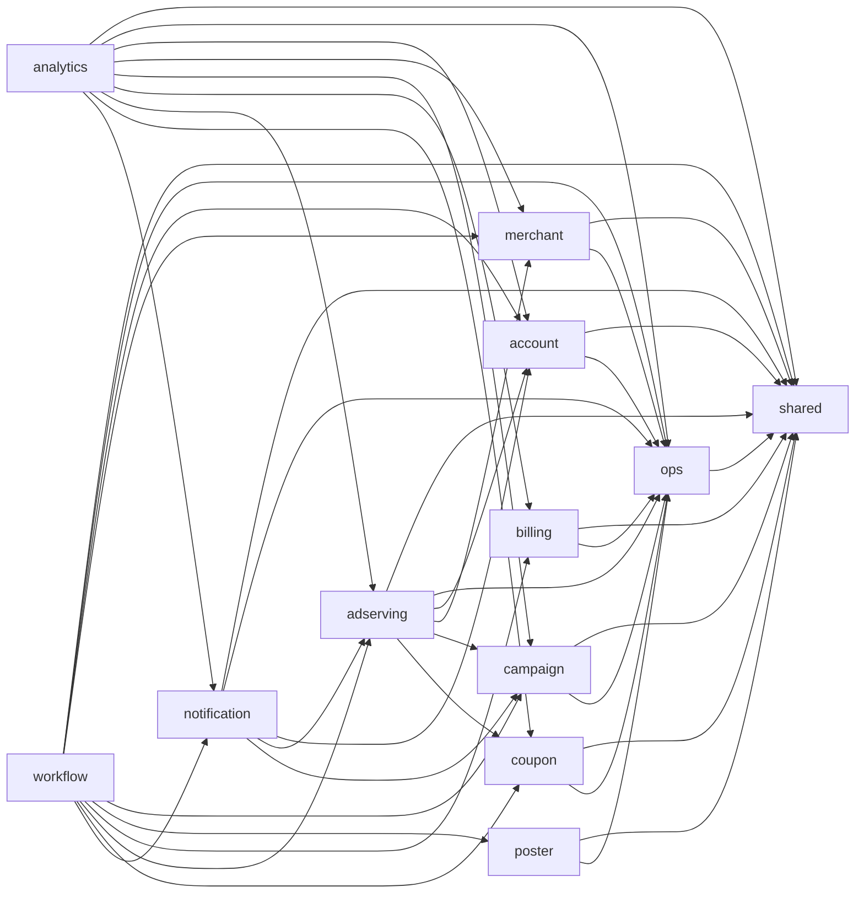
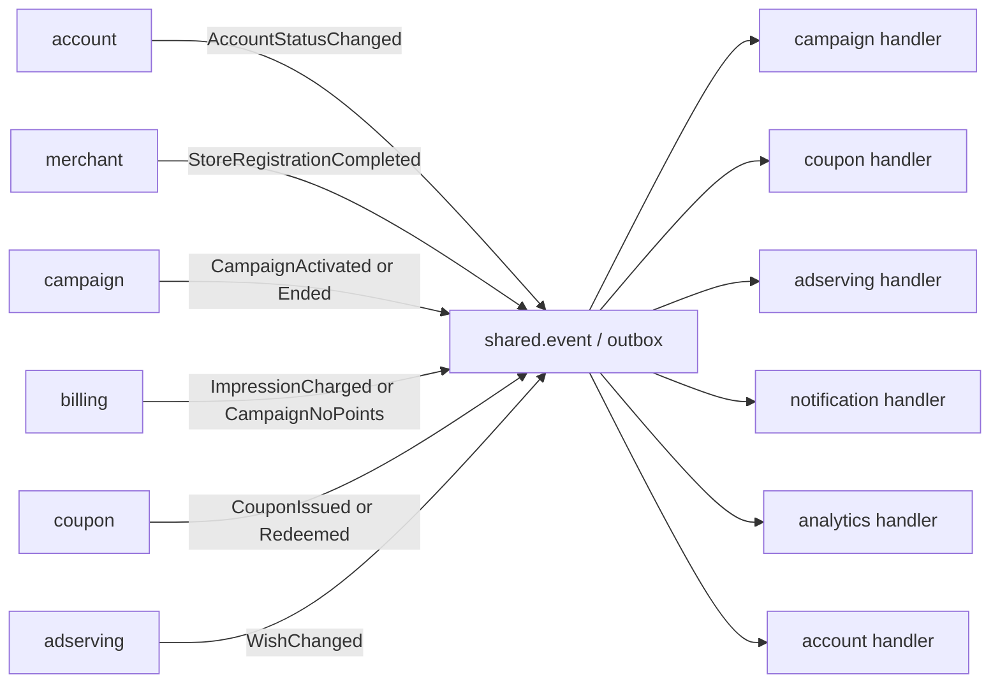

# 런치캐치 V21 도메인 참조 방향

분석일: 2026-09-22. 기준 문서는 `V21_런치캐치_요구사항명세서.xlsx`이며, 기능 명세서의 내부 버전은 `v0.26 초안`이다. 이 문서는 요구사항을 구현하기 위한 모듈러 모놀리스 설계안이다. 엑셀에 없는 클래스명·패키지명은 제안이다.

## 1. 먼저 정한 기준

이 문서에서 `A → B`는 **A 모듈의 코드가 B가 공개한 Java 타입(조회 서비스, 명령 서비스, DTO)을 import하는 방향**이다. 다음과는 별개다.

- 테이블의 FK 방향. `campaign_id`를 저장한다고 `coupon → campaign` 코드 참조가 생기는 것은 아니다.
- API 호출의 화면 순서나 데이터가 흘러가는 방향.
- 이벤트의 생산자와 소비자 관계. 이벤트는 `shared.event` 계약만 함께 참조한다.

모든 도메인은 다른 도메인의 Entity, Repository, 내부 Redis 키를 import하지 않는다. 필요한 데이터는 그 도메인의 좁은 공개 조회 계약으로 읽는다. 예를 들어 광고 서빙은 `AccountAudienceReader`를 읽을 수 있지만 `AccountRepository`를 직접 쓰지 않는다.

V21의 도메인은 다음 10개로 확정한다.

| 모듈 | 소유 데이터와 규칙 |
| --- | --- |
| `account` | Admin·Owner·User 계정, 인증 세션, 프로필·동의·저장 위치·관심 가게 |
| `merchant` | 가게, 입점 진행, 메뉴·이미지·지도·사업자 검증 |
| `campaign` | 쿠폰 조건 원본, 노출 대상, 일 예산, 집행 기간, 캠페인 상태 |
| `poster` | 템플릿·버전, 포스터, 자동 검수 기준과 결과 |
| `billing` | 노출 유효·무효 이력, 결제·환불, 포인트 원장·잔액·단가 |
| `adserving` | serve 기록, 피드 배분·관련성·페이싱, 찜·패스·필터·차단 목록 |
| `coupon` | 발급 쿠폰, 순번·QR·사용·만료. 발급 당시 쿠폰 조건 스냅샷 |
| `notification` | 발송 이력·수신함·중복 방지 |
| `analytics` | 퍼널 이벤트 로그, 일별 집계, 대시보드·리포트 |
| `ops` | 설정값·변경 이력, 배치 실행 이력, 감사 로그, 배정 진단의 공통 실행 틀 |

V14에서 분리했던 `impression`은 V21에서 `billing`으로 통합했다. `monitoring`은 `analytics`와 `ops`로 나뉜다. 찜·패스·차단은 `adserving`, 관심 가게는 `account`가 소유한다.

## 2. 계층과 공용 계약

```text
com.launchcatch
├── shared                 # 값 객체, AuthenticatedActor, Event 계약, 공용 오류 형식
├── ops                    # 설정·스케줄 실행·감사·진단의 프레임워크와 공개 포트
├── account                # 아래 모든 업무 도메인은 독립적으로 배치
├── merchant
├── campaign
├── poster
├── billing
├── adserving
├── coupon
├── notification
├── analytics
└── workflow               # 여러 도메인을 원자적으로 조합하는 유스케이스만 둠
```

`workflow`는 새로운 비즈니스 도메인이나 두 번째 Spring Boot Application이 아니다. 한 HTTP 요청에서 여러 애그리거트를 조합해야 하고, 도메인끼리 서로 참조하면 순환이 생기는 경우에만 둔다. 단순 CRUD를 모두 `workflow`로 옮기지 않는다.

`shared`에는 다음처럼 작고 안정적인 타입만 둔다.

- `AuthenticatedActor(memberId, role)`: 인증 필터가 만든 요청 주체. 각 도메인이 매 요청마다 `AccountRepository.findById`를 호출하지 않게 한다.
- `DomainEvent`, `EventId`, `BusinessDate`: 이벤트 생산자와 소비자가 함께 보는 계약.
- `ErrorCode`, 시간·식별자 값 객체.

`ops`는 하부 모듈이다. 각 도메인은 `OpsConfigReader`, `ScheduledJob`, `AuditWriter`, `DiagnosticDataSource` 같은 **ops의 공개 포트**만 참조할 수 있다. `ops`는 `CampaignService`나 `CouponRepository`를 import하지 않는다. 실제 작업 구현체는 각 도메인이 등록하고 ops는 인터페이스로 실행한다.

## 3. 직접 코드 참조 그래프

아래 실선은 허용하는 직접 import 방향이다. 모든 화살표는 공개 Query/Command/DTO에 한정한다.



`analytics`의 화살표는 일별 집계나 진단처럼 명세가 허용한 읽기 전용 예외다. 일반 조회는 자기 집계 테이블과 이벤트 로그만 읽는다. 어느 업무 도메인도 `analytics`를 직접 참조하지 않는다.

모든 업무 도메인에서 `ops`로 향하는 선은 설정 조회, 감사 기록, 스케줄 작업 등록을 뜻한다. ops가 상위 도메인을 참조한다는 뜻은 아니다.

## 4. 도메인별 허용·금지 참조

| 호출 모듈 | 허용하는 직접 참조 | 이유 | 직접 참조하면 안 되는 모듈 |
| --- | --- | --- | --- |
| `account` | `shared`, `ops` | 인증 컨텍스트, 감사 기록 | merchant, campaign, coupon 등 업무 도메인 |
| `merchant` | `shared`, `ops` | 입점 데이터와 작업 등록 | account의 Repository, campaign |
| `campaign` | `shared`, `ops` | 캠페인 자체 상태 전이 | poster, billing, merchant |
| `poster` | `shared`, `ops` | 템플릿·포스터·검수 독립 소유 | campaign |
| `billing` | `shared`, `ops` | 원장과 과금의 최종 권한 | adserving, campaign |
| `adserving` | account·merchant·campaign·coupon의 공개 Reader, `ops` | 후보, 타겟, 위치, 재고 가능 여부를 읽어 피드 구성 | billing의 Repository·원장 |
| `coupon` | `shared`, `ops` | 발급·QR·사용·만료 독립 소유 | adserving, campaign, account의 Repository |
| `notification` | account·adserving·campaign의 공개 Reader, `ops` | 동의·찜·당일 ACTIVE를 발송 직전에 재확인 | coupon, analytics |
| `analytics` | 각 도메인의 공개 Export/Reader, `ops` | 배치 집계·리포트·진단의 읽기 전용 소비자 | 다른 도메인의 Command·Repository |
| `ops` | `shared`만 | 작업 순서·멱등·포트 실행 | 어떤 업무 도메인의 Service/Repository |
| `workflow` | 필요한 도메인의 공개 Query/Command | 다도메인 유스케이스 조합 | Repository와 Entity |

### 4.1 `campaign → poster`, `poster → campaign`을 만들지 않는 방법

캠페인 활성화는 `CampaignActivationWorkflow`가 다음 순서로 조합한다.

1. `merchant`에서 가게·점주 상태를 조회한다.
2. `poster`에서 포스터 존재와 자동 검수 결과를 조회한다.
3. `billing`에서 활성화에 필요한 잔액을 조회한다.
4. 모두 통과하면 `campaign.schedule(...)`만 호출한다.

포스터 생성·수정은 `PosterAuthoringWorkflow`가 캠페인의 소유권·편집 가능 상태를 확인한 뒤, 검증된 `campaignId`, `storeId`, `ownerId`, 쿠폰 조건 스냅샷을 poster에 전달한다. poster는 자기 포스터의 `ownerId`로 이후 편집 권한을 검사한다. 따라서 `poster`가 Campaign Entity를 조회할 필요가 없다.

### 4.2 `adserving ↔ billing`을 만들지 않는 방법

V21에서 광고 서빙은 예산 소진 진행률을 사용하고, 정산은 `serve_id`를 검증해 유효 노출을 과금한다. 두 서비스가 서로 호출하면 가장 위험한 순환이 생긴다.

- 피드 후보 선정: `adserving`은 자기 `DeliveryProgressProjection`과 `coupon`의 잔여 수량을 사용한다. 이 projection은 과금 결과 이벤트로 갱신한다. billing 원장을 실시간으로 직접 조회하지 않는다.
- 노출 수집: `ImpressionCaptureWorkflow`가 `adserving`에서 `ServeValidationContext`를 얻고 `billing.recordImpressionAndDeduct(...)`를 호출한다. billing은 검증된 서버 발행 컨텍스트만 받아 원장과 유효·무효 노출 이력을 확정한다.
- 잔액 부족 또는 과금 완료: billing은 `CampaignNoPoints`, `ImpressionCharged` 이벤트를 기록한다. campaign과 adserving은 각자 이벤트를 소비해 중단 상태와 진행률 projection을 갱신한다.

이렇게 하면 billing은 원장의 최종 권한을 유지하고 adserving은 피드 성능에 필요한 읽기 모델을 소유한다. projection이 잠시 늦더라도 billing의 원자 차감이 최종 방어선이므로 허용 한도 밖의 차감은 일어나지 않게 한다.

### 4.3 `coupon ↔ adserving`, `coupon → campaign`을 만들지 않는 방법

쿠폰 발급은 찜 여부가 필요하고, 피드는 남은 쿠폰 수량이 필요하다. 둘이 서로 참조하지 않도록 `CouponIssuanceWorkflow`가 조합한다.

1. `adserving.WishReader`로 찜 여부를 확인한다.
2. `coupon.IssueCouponCommand`로 원자 발급을 요청한다.

당일 `issue_open` 준비 시에는 `campaign`의 쿠폰 조건과 수량을 `CouponSupplySnapshot`으로 coupon에 적재한다. 발급된 쿠폰에는 할인 조건·사용 가능 시간·storeId·ownerId의 불변 `CouponTermsSnapshot`을 저장한다. 그러면 발급, 쿠폰함, QR, 사용 처리에서 coupon이 campaign 또는 merchant를 실시간 조회하지 않아도 된다. adserving은 `coupon.CouponAvailabilityReader`만 단방향으로 읽는다.

### 4.4 account를 모든 도메인이 직접 참조하지 않는 방법

로그인 사용자 ID는 클라이언트가 보내는 `memberId`가 아니라 인증 필터가 서명 토큰과 valid-after cutoff로 검증해 만든 `AuthenticatedActor`다. 따라서 자신의 리소스 권한은 `campaign.ownerId == actor.memberId`처럼 해당 도메인의 소유자 필드로 검사한다.

다만 피드의 성별·연령·위치·위치 동의는 실제 account 소유 데이터이므로 `adserving → account`는 정상적인 업무 참조다. 알림의 수신 동의도 `notification → account`가 정상이다. 이것은 인증을 위한 무차별 `AccountRepository.findById`와 구분한다.

## 5. 이벤트 방향: 상태 변경은 계약으로 연결

V21의 "도메인 간 상태 변경은 이벤트" 규칙은 아래처럼 구현한다. 생산자와 소비자는 서로를 import하지 않고 모두 `shared.event`의 이벤트 타입만 안다.



권장 구현은 각 원본 상태 변경 트랜잭션에서 업무 데이터와 outbox 행을 함께 저장하고, `ops`의 범용 relay가 이를 전달하는 방식이다. 소비자는 `(event_id, consumer)`을 유니크하게 기록해 멱등 처리한다. 이 방식은 `@TransactionalEventListener`를 사용하지 않는다.

| 이벤트 | 생산자 | 소비자 | 효과 |
| --- | --- | --- | --- |
| `StoreRegistrationCompleted` | merchant | account | 점주 ACTIVE 전환 요청 |
| `AccountStatusChanged` | account | campaign, coupon, adserving | 점주 캠페인 중단, 사용자 쿠폰 만료, 피드 제외 projection 갱신 |
| `CampaignActivated` | campaign | coupon, notification, adserving | 당일 공급 준비, 관심 가게 알림 후보·피드 후보 갱신 |
| `CampaignNoPoints` | billing | campaign, adserving | PAUSED(NO_POINTS), 다음 피드 후보 제외 |
| `ImpressionCharged` | billing | adserving, analytics | 예산 소진 진행률과 퍼널 집계 갱신 |
| `WishChanged` | adserving | notification, analytics | 10:50 대상 재검증과 퍼널 집계 |
| `CouponIssued`, `CouponRedeemed`, `CouponExpired` | coupon | analytics | 퍼널·리포트 집계 |

`notification`은 발급 성공 이벤트만 보고 즉시 보내지 않는다. V21의 필수 알림은 10:50 오픈 알림이다. 스케줄 작업이 시작되면 notification이 찜·관심·동의·ACTIVE 상태를 다시 조회해 발송한다.

## 6. 즉시성이 필요한 두 흐름

이벤트는 기본적으로 비동기다. 그런데 V21의 회원 정지에는 "즉시 캠페인 중단·쿠폰 만료"가, 노출 과금에는 다음 피드부터 제외가 요구된다. 여기서는 요구사항을 둘 중 하나로 명확히 해야 한다.

1. 수 초 이내의 전파를 허용한다면 outbox 이벤트와 projection 갱신만 사용한다.
2. 같은 요청이 성공한 순간 모든 상태가 바뀌어야 한다면 `workflow`의 명시적 조정 유스케이스를 사용한다.

현재 문구에는 2가 더 맞다. 따라서 `MemberRestrictionWorkflow`는 하나의 DB 트랜잭션에서 `account.changeStatus`, `campaign.pauseByAccountStatus`, `coupon.expireByAccountStatus`의 **공개 Command**를 조합한다. 각 도메인의 Repository는 여전히 자기 서비스 안에서만 사용한다. 커밋 후에는 outbox 이벤트로 adserving 캐시와 analytics를 갱신한다.

이는 `account → campaign → coupon` 직접 의존이 아니다. workflow만 세 도메인을 참조한다. 이 예외를 두지 않고 이벤트만 쓴다면 "즉시"라는 요구를 "비동기 전파 후"로 낮춰야 한다.

## 7. ops와 스케줄러

`ops`의 스케줄러는 업무 로직을 갖지 않는다. `ScheduledJob` 구현체를 실행하고 `(job_name, business_date)` 실행 이력·성공·실패·처리 건수만 관리한다.

```text
ops.scheduler.DailyJobRunner
  ├── campaign.CampaignDailyTransitionJob
  ├── coupon.CouponSupplyPreparationJob
  ├── adserving.DailyServingHistoryResetJob
  ├── billing.LedgerReconciliationJob
  ├── notification.OpenReminderJob
  ├── coupon.CouponIssueOpenJob
  ├── coupon.CouponExpiryJob
  └── analytics.DailyAggregationJob
```

00:00에는 `CampaignDailyTransitionJob` 성공 뒤에만 다음 Job을 실행하도록 의존 순서를 구성한다. 어느 Job이 실패하면 이후 Job은 실행하지 않고, 실패한 Job만 재실행한다. `ops`는 각 클래스를 import하지 않고 Spring 등록된 `ScheduledJob` 구현체와 작업 이름으로만 실행한다.

## 8. 구현 시 지켜야 할 체크리스트

- 다른 도메인의 `Repository`, JPA Entity, Redis key를 import한 코드가 없는가.
- 화면에 여러 도메인 정보가 보여도 화면 조합은 `workflow` 또는 analytics 조회에서 하는가.
- `campaign ↔ poster`, `adserving ↔ billing`, `coupon ↔ adserving` 직접 참조가 없는가.
- 교차 상태 변경은 outbox 이벤트 또는 명시한 workflow 원자 조정으로 처리하는가.
- 인증 사용자 확인 때문에 모든 도메인이 `AccountRepository`를 찾지 않는가. 실제 프로필·동의 데이터가 필요한 경우만 account의 Reader를 쓰는가.
- analytics는 원본을 변경하지 않고 이벤트 로그·집계만 소유하는가.
- ops는 업무 Service를 import하지 않으며, 작업과 진단은 포트 구현체로 등록되는가.
